# Android CameraX MVVM

*Capture photos, record videos, and preview media with modern Android development practices.*

This project demonstrates how to implement **CameraX** in an Android application using the **MVVM** (Model-View-ViewModel) view pattern, combined with a **Clean Architecture** architectural pattern. The project includes features like capturing photos, recording videos, and previewing media with modern Android development practices.

## 📋 Features

- 📷 **Photo & Video Capture**: Take high-quality pictures and record videos using CameraX, with full support for exposure control, flash, and front/back camera switching.  
- 👀 **Media Preview**: Preview captured photos and videos.
- 🧱 **Clean Architecture**: Clean separation in layers: Domain, Data and View.
- 🎯 **Jetpack Components**: Uses Navigation, DataStore, and more.
- 💉 **Dependency Injection**: Powered by Dagger Hilt for modular and testable code.


## 🛠️ Tech Stack

- **Kotlin**: 100% Kotlin-based code.
- **CameraX**: For camera functionality.
- **Jetpack**:
  - Navigation Component
  - DataStore for managing preferences
  - ViewModel and LiveData for reactive UI updates
- **ExoPlayer**: For video playback.
- **Dagger Hilt**: Dependency Injection.


## 🚀 Getting Started

### Prerequisites
1. Android Studio (latest stable version recommended)
2. Android SDK 21+


### Setup
1. [ ] Clone the repository:
    ```bash
    git clone https://github.com/samuel0122/Android-CameraX-MVVM.git
    cd Android-CameraX-MVVM
    ```
2. [ ] Open the project in Android Studio.
3. [ ] Sync Gradle to download dependencies.
4. [ ] Run the app on a physical or virtual device.


## 📂 Project Structure

```
📂 app/
├── 📂 core/                # Utility classes and extensions
├── 📂 data/                # Data layer (e.g., repositories, DataStore management)
│   ├── 📂 mediaStorage     # Handles loading and saving media on disk
│   ├── 📂 dataPreferences  # Manages preferences using DataStore (e.g. last media URI)
│   ├── 🗒️ MediaRepository  # Repository to access media files (photos & videos)
├── 📂 di/                  # Dependency injection modules
├── 📂 domain/              # Domain layer (Use Cases, models and mappers)
├── 📂 ui/                  # View layer (Fragments, Adapters, ViewModels)
│   ├── 📂 camera/          # Media capture (photo/video) fragments and its ViewModels
│   ├── 📂 common/          # Common components that are shared along the whole app
│   ├── 📂 mainPage/        # Main app view and its ViewModel
│   ├── 📂 preview/         # Media preview (photo/video) fragments and its ViewModels
├── 🗒️ CameraXMvvmApp       # Application class for global inyection
├── 🗒️ MainActivity         # Application entry point and navigation host
```


## 📸 Screenshots

| | | |
|---|---|---|
| 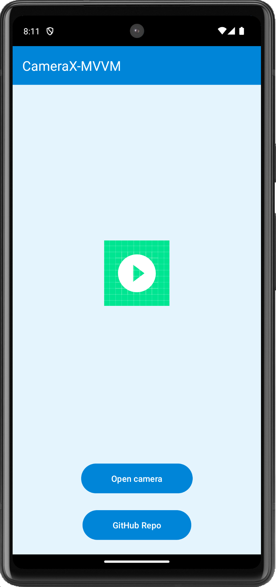 <br> **Main Screen (empty)** | 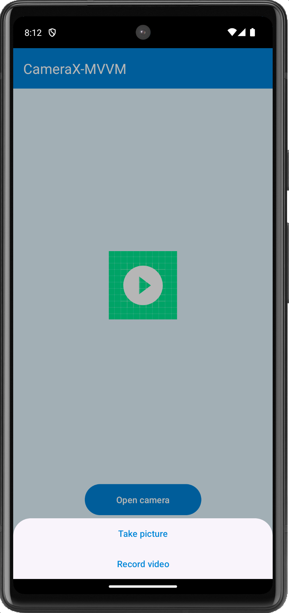 <br> **Camera Options** | 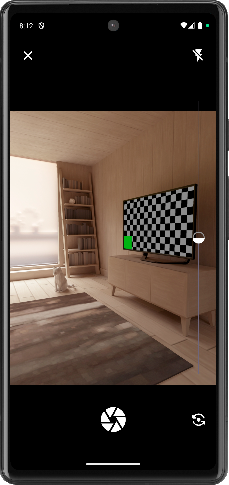 <br> **Taking a Picture** |
| 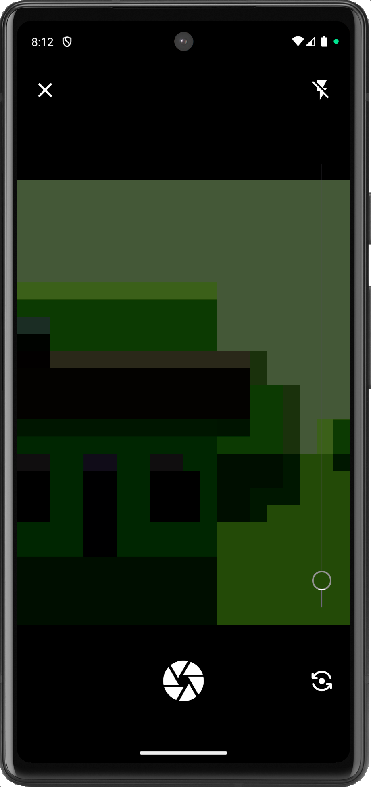 <br> **Selfie Mode** | 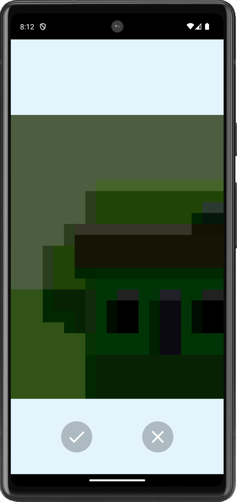 <br> **Picture Preview** | 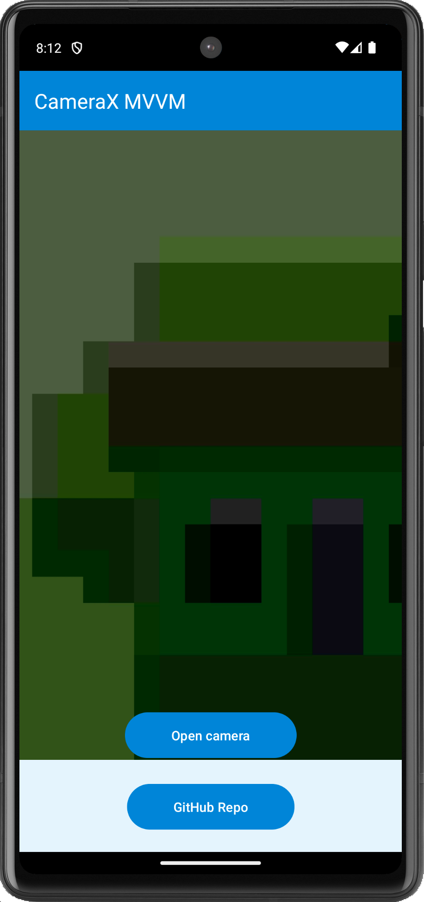 <br> **Main with Captured Photo** |
| 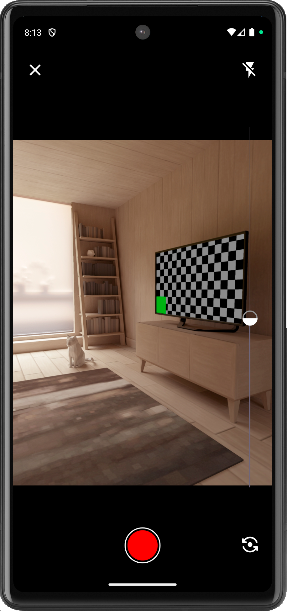 <br> **Video Recording Screen** | 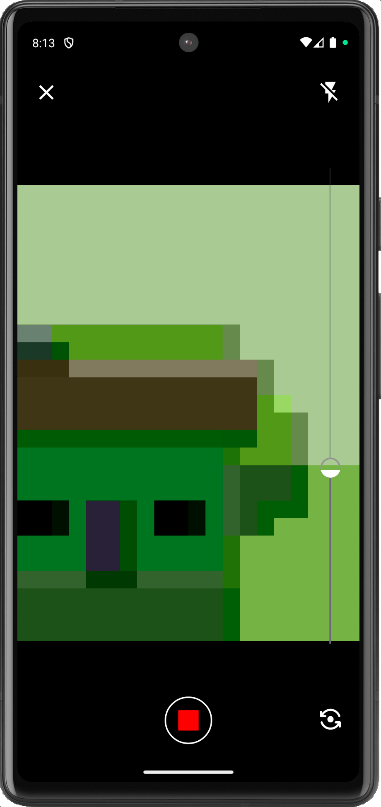 <br> **Recording in Selfie Mode** | 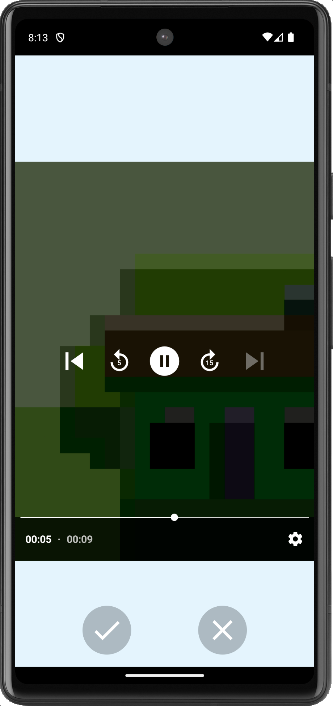 <br> **Recorded Video Preview** |
| 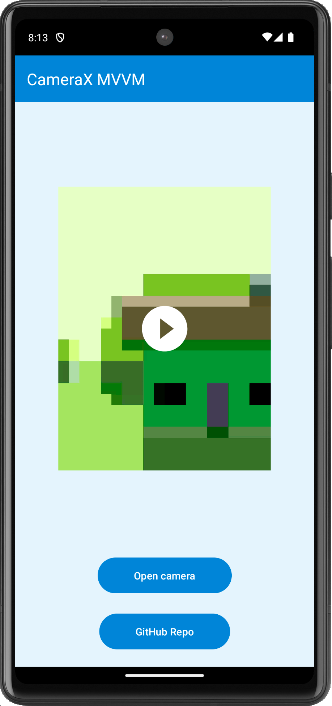 <br> **Main with Saved Video** | 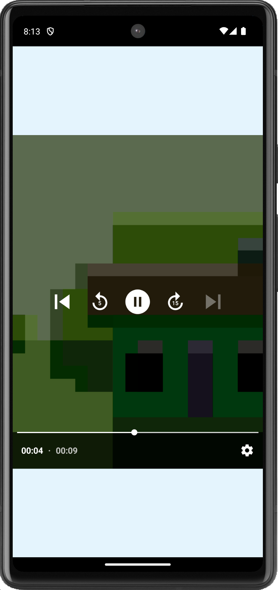 <br> **Playback Recorded Video** | |


## 🧑‍💻 Author

- [@samuel0122](https://www.github.com/samuel0122)

